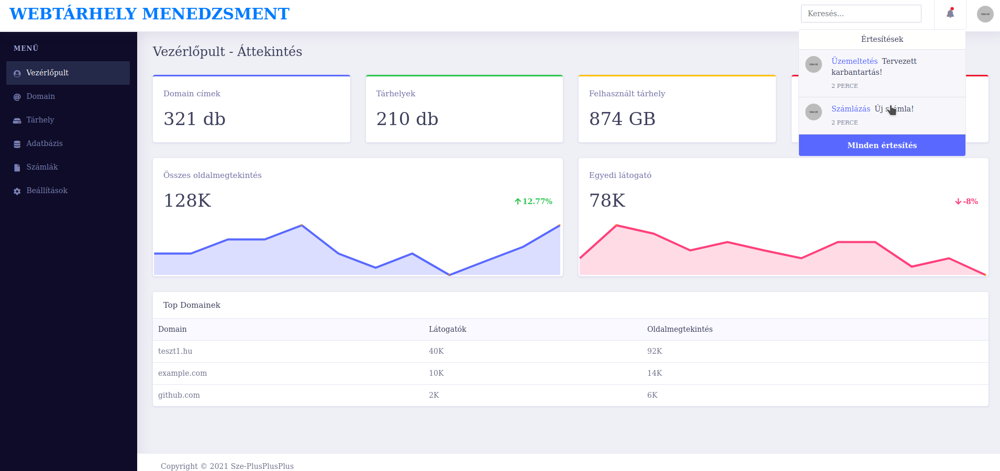
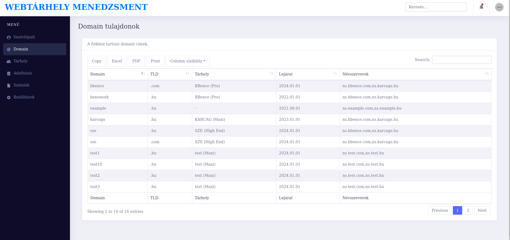
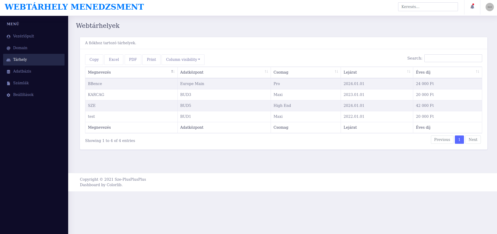
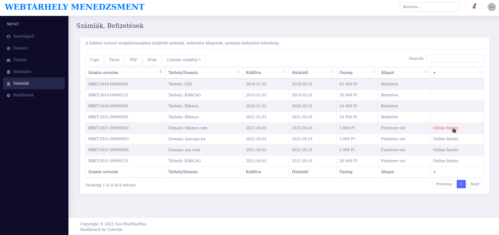

## GUI tervek

Tervek csak az adminisztatív, bejelentkezés után elérhető felülethez készültek. Tényleges oldal esetén, belépés nélkül, egy köszöntő, áttekintő, gyorsmegrendeléses oldalak is az oldal részét képeznék.

Statikus előnézet: https://sze-plusplusplus.github.io/adatbazisok/gui/

### Adminisztatív kezdőlap

### Domain kezelés

### Tárhely kezelés

### Számlák/Befizetések kezelése

> Téma forrása: https://github.com/puikinsh/concept

