## Kérdések

1. Hány _.com_ TLD-jű domain van beregisztrálva a rendszerbe?

```sql
SELECT COUNT(d.TLD) as AddressCount FROM Domain d
GROUP BY d.TLD
HAVING d.TLD LIKE 'com';
```

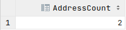

2. Hol találhatók Adatközpontok és mi a jeligéjük?

```sql
SELECT dc.City, CenterName(dc.City, dc.Number) as Keyword FROM DataCenter dc
ORDER BY Keyword;
```

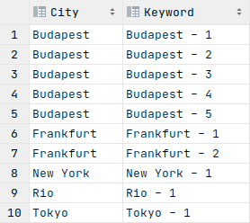

3. Mi a 3 legtöbb szerverteremmel rendelkező város neve? (Csokkenő sorrend és a darabszámok is jelenjenek meg)

```sql
SELECT dc.City, COUNT(dc.Id) as Count FROM DataCenter dc
GROUP BY dc.City
ORDER BY Count DESC, dc.City
LIMIT 3;
```

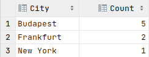

4. Mely csomagok tartalmaznak PHP futtatási lehetőséget?

```sql
SELECT st.Name FROM StorageType st
WHERE st.PHPEnabled;
```

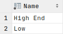

5. Mely webtárhelyek rendelkeznek SSH eléréssel és sávszélességük legalább 1 Gigabit/s, illetve mikor lettek ezek létrehozva?

```sql
SELECT s.Name, s.Creation FROM Storage s
INNER JOIN StorageType st ON st.Id = s.TypeId
WHERE st.SSHEnabled AND s.MaximumDataTraffic >= 1;
```

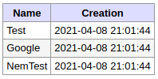

6. Mely webtárhelyek nem rendelkezik egy Domain címmel sem?

```sql
SELECT s.Name FROM Storage s
LEFT JOIN Domain d ON d.StorageId = s.Id
GROUP BY s.Name
HAVING COUNT(d.Id) = 0
```

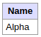

7. Van-e az _1_-es Id-val rendelkező felhasználónak közvetlen nem kifizetett számlája és mi annak az azonosítója?

```sql
SELECT b.BillId FROM Bill b
LEFT JOIN Payment p ON p.BillId = b.Id
WHERE b.UserId = 1 && p.Id IS NULL && b.Deadline >= NOW();
```

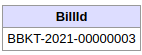

8. Melyek azok a domain címek, amikhez a kapcsolt tárhely lejárt és mikor?

```sql
SELECT DomainAddress(d.DomainAddress, d.TLD) as Address, s.Expiration FROM Domain d
INNER JOIN Storage s ON s.Id = d.StorageId
WHERE s.Expiration <= NOW();
```

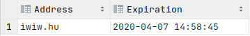

9. Milyen kifizetések történtek _2019-09-12_ - _2020-02-23_ között regisztrált felhasználóknak? Melyik felhasználónak és mi volt a tranzakció azonosítója?

```sql
SELECT u.UserName, p.TransactionId FROM User u
INNER JOIN Payment p ON u.Id = p.UserId
WHERE p.Date BETWEEN '2019-09-12' AND '2020-02-23';
```

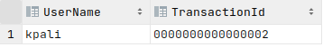

10. Éves statisztika az egyes domain címekhez, amik tartalmazzák az összes látógatást és az összes egyedi látógatót.

```sql
SELECT DomainAddress(d.DomainAddress, d.TLD) as Address, YEAR(s.Month) AS Year, SUM(s.Views) AS ViewSum, SUM(s.UniqueViewers) as UViewSum FROM Domain d
INNER JOIN Statistic s ON s.DomainId = d.Id
GROUP BY DomainAddress, Year;
```

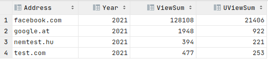

11. Melyek azok az adatközpontok, ahol legalább a webtárhelyek fele rendelkezik adatbázissal, PHP-val és e-mail fiókkal is?

```sql
SELECT CenterName(dc.City, dc.Number) AS Center FROM DataCenter dc
INNER JOIN Storage s on dc.Id = s.DataCenterId
INNER JOIN StorageType st on s.TypeId = st.Id
WHERE st.PHPEnabled && st.MaximumEmailAccounts > 0
GROUP BY dc.Id
HAVING COUNT(s.Id) >= GetStorageNumber(dc.Id) / 2;
```

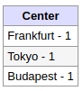

12. Mely PHP futtatással rendelkező domainen lesz karbantartás a következő hónapban (30 nap), a _BUD1_ adatközpontban?

```sql
SELECT DomainAddress(d.DomainAddress, d.TLD) AS Address FROM Domain d
INNER JOIN Storage s on d.StorageId = s.Id
INNER JOIN StorageType st on s.TypeId = st.Id
INNER JOIN DataCenter dc on s.DataCenterId = dc.Id
INNER JOIN Notification n on d.Id = n.DomainId
WHERE dc.Name = 'BUD1' AND st.PHPEnabled AND n.Title = 'maintenance' AND n.TimeFrameEnd <= DATE_ADD(NOW(), INTERVAL 30 DAY);
```

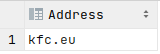

13. Mely _.hu_ domain nevek voltak az utóbbi _2 hónapban_ befizetve?

```sql
SELECT DomainAddress(d.DomainAddress, d.TLD) as Domain FROM Domain d
INNER JOIN Bill b on d.Id = b.DomainId
INNER JOIN Payment p on b.Id = p.BillId
WHERE d.TLD = 'hu' AND p.Date >= DATE_SUB(NOW(), INTERVAL 2 MONTH);
```

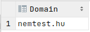

14. Az egyes felhasználók mennyi aktív értesítéssel rendelkeznek?

```sql
SELECT u.UserName, GetActiveUserNotifications(u.Id) Notifications FROM User u;
```

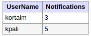

15. Melyek azok a domain nevek, amelyek _Maxi_ csomaggal rendelkeznek?

```sql
SELECT DomainAddress(d.DomainAddress, d.TLD) as Address FROM Domain d
INNER JOIN Storage s on d.StorageId = s.Id
INNER JOIN StorageType st on s.TypeId = st.Id
WHERE st.Name = 'Maxi';
```

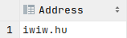

16. Melyik a legterheltebb adatközpontok? (Foglalt GB / Látogatottság)

```sql
SELECT CenterName(dt.City, dt.Number) AS Center FROM DataCenter dt
INNER JOIN Storage s on dt.Id = s.DataCenterId
INNER JOIN Domain d on s.Id = d.StorageId
INNER JOIN Statistic stat on d.Id = stat.DomainId
GROUP BY dt.Id
ORDER BY SUM(s.DatabaseSize / stat.Views);
```

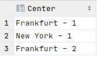

17. Kik azok a felhasználók, akik a határidő előtti napon fizették be a számlát? (és melyek ezek a számlák?)

```sql
SELECT b.BillId, u.FullName FROM User u
INNER JOIN Bill b on u.Id = b.UserId
INNER JOIN Payment p on b.Id = p.BillId
WHERE p.Date < b.Deadline AND p.Date > SUBDATE(b.Deadline, INTERVAL 1 DAY);
```

18. A top 5 PHP futtatás nélküli weboldalak és tulajdonosaik, amelyek látogatottsága a legmagasabb?

```sql
SELECT DomainAddress(d.DomainAddress, d.TLD) AS DomainAdd, u.FullName FROM Domain d
INNER JOIN Storage s on d.StorageId = s.Id
INNER JOIN StorageType st on s.TypeId = st.Id
INNER JOIN Statistic stat on d.Id = stat.DomainId
INNER JOIN User u on d.UserId = u.Id
WHERE NOT st.PHPEnabled
GROUP BY DomainAdd
ORDER BY SUM(stat.Views) DESC
LIMIT 5;
```

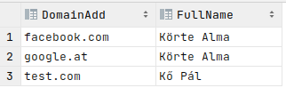

<div class="page-break"></div>
